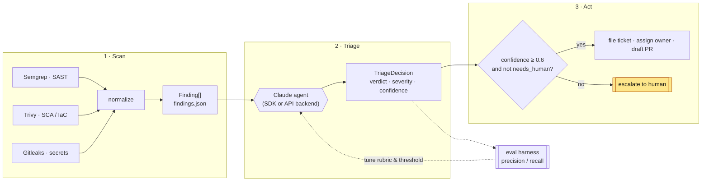
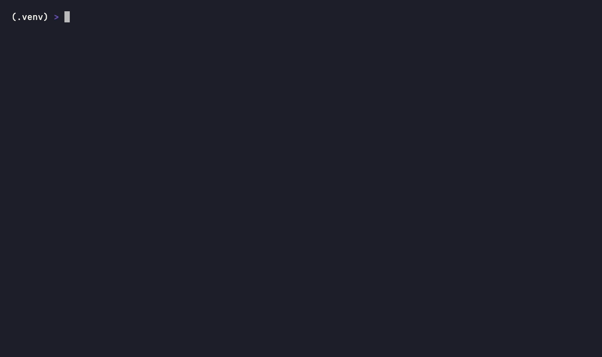
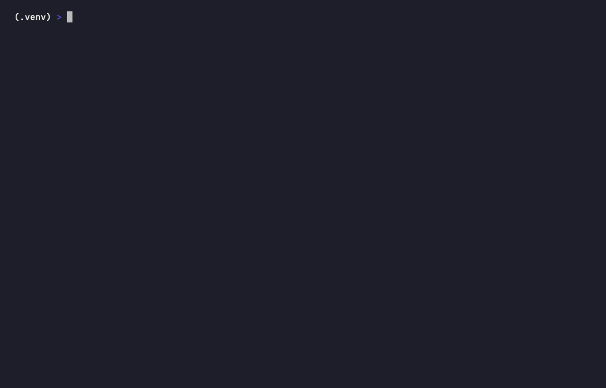

# AutoTriage

[](https://github.com/rohanbatrain/autotriage/actions/workflows/ci.yml)


**An autonomous vulnerability-triage agent: it ingests Semgrep/Trivy/Gitleaks findings, reasons about severity and business impact, and acts — filing tickets, assigning owners, drafting remediation PRs, and re-scanning to prove its own fixes work — while escalating anything it is not sure about to a human.**

Built with the Claude Agent SDK (and an Anthropic Messages API backend). AutoTriage turns a raw pile of scanner output into an owned, prioritized, partly self-remediating backlog, and it ships with an **eval harness** that scores its own triage quality against a labeled set — the part most agent demos skip. It also **closes the loop**: a proposed fix is applied to an isolated copy of the code and the scanner re-run, so a remediation is trusted only when the finding is verifiably gone.

> On a live scan of the bundled vulnerable target, AutoTriage triaged **44 real findings into 24 tickets and 20 human escalations**; on the labeled eval set it scored **100% verdict accuracy** with both planted false positives correctly suppressed.

---

## JD coverage map

| JD requirement | Covered by |
|---|---|
| Claude Code / Agent SDK, not just chat | `autotriage.agent` harness (SDK + Messages API backends) |
| Read SAST/DAST/scanner output | Semgrep (SAST) + Trivy (SCA/IaC) + Gitleaks (secrets) |
| Reason about severity & business impact | LLM triage rubric → `verdict` + `business_impact` |
| Take action autonomously | tickets, owner assignment, draft PRs, `TRACKER.md` |
| **Eval + guardrails (most applicants skip!)** | `evals/` labeled set + precision/recall scorer + [eval methodology](docs/eval-methodology.md) |
| Beyond triage: auto-PR, **fix-validation**, auto-summarize | remediation PR drafts, [`autotriage.revalidate`](docs/fix-validation.md) re-scan loop, [stakeholder risk summary](docs/risk-summary-sample.md) |
| Safe-to-act vs escalate to human | confidence threshold → `needs_human` escalation, enforced in the type layer |
| Python + REST + Git + CI/CD | matrix CI, PR-triage workflow, Dockerfile, Makefile |
| Terraform / IaC (plus) | Trivy scans planted insecure `.tf` |
| Structured output + tool calling | Pydantic contracts + forced tool use |

---

## Architecture

A three-stage pipeline over two typed contracts (`Finding` and `TriageDecision`, defined once in `autotriage.schema`), with an evaluation loop and a human-in-the-loop escalation path.



Full write-up, C4 views, and trust boundaries: [`docs/architecture.md`](docs/architecture.md).

---

## Quickstart

```bash
# 1. Environment
python -m venv .venv && source .venv/bin/activate
pip install -e ".[agent,dev]"

# 2. Scanners (macOS/Homebrew shown; see each tool's docs for Linux)
pip install semgrep && brew install trivy gitleaks

# 3. Scan a target into normalized findings
python -m autotriage.scanners target/ -o findings.json

# 4. Triage (SDK or Messages API backend). --dry-run previews without writing.
python -m autotriage --findings findings.json --backend api

# 5. Score triage quality against the labeled set (offline stub — no API key)
python evals/run_eval.py --stub

# 6. Close the loop: apply proposed fixes to an isolated copy and re-scan to
#    confirm each finding is actually resolved (needs the relevant scanner)
python -m autotriage.revalidate --target target \
    --findings examples/fix-validation/findings.json \
    --patches examples/fix-validation/patches.json
```

Live triage needs `ANTHROPIC_API_KEY` in the environment; `--dry-run` and `run_eval.py --stub` run without one. Common dev tasks are wrapped in the [`Makefile`](Makefile) (`make all`, `make cov`, `make security`), and a container image is provided ([`Dockerfile`](Dockerfile)). Configuration reference: [`docs/configuration.md`](docs/configuration.md).

---

## Demos

Terminal recordings (made with [VHS](https://github.com/charmbracelet/vhs) — regenerate any time with `make demos`):

**The CLI surface** — `python -m autotriage --help`



**Offline evaluation** — `python evals/run_eval.py --stub` scores triage against the labeled set, no API key needed:


**Quality gate** — the full test suite:



> Every command and end-to-end flow is documented in **[docs/USAGE.md](docs/USAGE.md)**; a guided walkthrough of the code is in **[docs/CODE_TOUR.md](docs/CODE_TOUR.md)**.

---

## Documentation

| Area | Documents |
|---|---|
| **Getting started** | [Usage — every command & flow](docs/USAGE.md) · [Code tour](docs/CODE_TOUR.md) |
| **Architecture & design** | [Architecture](docs/architecture.md) · [ADRs](docs/adr/README.md) · [Data contracts](docs/data-contracts.md) |
| **Security** | [Threat model (STRIDE)](docs/threat-model.md) · [Security posture](docs/security-posture.md) · [Escalation policy](docs/escalation-policy.md) · [SECURITY.md](SECURITY.md) |
| **Operations** | [Operations & SLOs](docs/operations.md) · [Deployment](docs/deployment.md) · [Configuration](docs/configuration.md) · [Runbooks](docs/runbooks/) |
| **Quality** | [Eval methodology](docs/eval-methodology.md) · [Fix-validation loop](docs/fix-validation.md) · [Sample risk summary](docs/risk-summary-sample.md) · [`examples/`](examples/) (real generated output) |
| **Contributing** | [CONTRIBUTING](CONTRIBUTING.md) · [CODE_OF_CONDUCT](CODE_OF_CONDUCT.md) · [CHANGELOG](CHANGELOG.md) · [SUPPORT](SUPPORT.md) |

---

## Testing & quality

The quality gate is enforced automatically in CI (`.github/workflows/ci.yml`), on a Python **3.11 / 3.12 matrix** — not by convention:

- **PEP 8 / PEP 257** — `ruff check` (incl. `D` pydocstyle + `B` bugbear rules) and `ruff format --check`.
- **PEP 484 strict typing** — `mypy --strict` over `src` (the package ships a `py.typed` marker).
- **Test pyramid — 63 tests, ~90% branch coverage** (gate: `--cov-fail-under=80`):
  unit (schema, scanners, tools, eval, **fix-validation**) · **integration** (full scan→triage→act flow with a *mocked* LLM, no network) · **property-based** ([Hypothesis](https://hypothesis.readthedocs.io/): normalizers never crash, guardrail invariants always hold) · **golden/snapshot** (ticket & PR rendering) · **CLI**.
- **Security self-scanning** — `bandit -r src` (SAST on our own code) and `pip-audit` (dependency CVE audit) run in CI.
- **Supply chain** — Dependabot (pip + actions), minimum-version floors, `detect-private-key` pre-commit hook.

Run the whole gate locally with `make all && make cov && make security`.

---

## Guardrails & safety

AutoTriage acts autonomously *only* where it is safe to, and fails toward human review everywhere else — enforced in code, not just the prompt:

- **Confidence threshold → human escalation.** Any `TriageDecision` with `confidence < 0.6` is coerced by a Pydantic validator to `verdict = needs_human` / `recommended_action = escalate`. The agent can never silently auto-action something it is unsure about.
- **Fail closed.** If a finding can't be triaged (malformed model output or a transient API error), the batch does not abort — that finding is escalated to a human.
- **Prompt-injection defense.** Scanner output (code snippets, descriptions, dependency metadata) is treated as **untrusted input**; the system prompt forbids following instructions embedded in it. See [ADR-0006](docs/adr/0006-treat-scanner-output-as-untrusted.md).
- **Human-in-the-loop.** Every side effect goes through a validated tool call. `CRITICAL` findings auto-open a ticket but require human sign-off before any remediation PR is merged. Full decision table: [`docs/escalation-policy.md`](docs/escalation-policy.md).
- **Fixes are proven, not trusted.** A proposed remediation is applied to an *isolated copy* of the code and the scanner re-run ([`autotriage.revalidate`](docs/fix-validation.md)). The fix is accepted only if the finding's signature is gone **and** no new finding was introduced; a fix that doesn't resolve the issue, introduces a regression, applies ambiguously, or can't even be reproduced in the baseline is rejected and escalated. Fail closed, same as the confidence gate.

---

## Production readiness

This is a strong, tested reference implementation with production-*minded* engineering — and it documents its own limits honestly rather than overclaiming.

| Implemented | Roadmap (see [operations.md](docs/operations.md) · [threat-model.md](docs/threat-model.md)) |
|---|---|
| Typed contracts, strict typing, 63 tests @ ~90% cov, matrix CI, bandit + pip-audit | Async triage + rate-limit/backoff (currently sequential) |
| Guardrails: confidence threshold, fail-closed escalation, prompt-injection defense | Real GitHub/Jira actions (PRs are drafted as Markdown today) |
| **Fix-validation loop**: patch an isolated copy, re-scan, accept only if verifiably resolved | Auto-apply validated fixes as real PRs; multi-file patches at repo scale |
| Structured JSON logging with `run_id`, env-driven config (`config.py`) | Cost/latency metrics, alerting, secret **redaction** in ticket bodies |
| Eval harness with precision/recall/severity metrics | Larger multi-labeler eval set + CI eval gate; severity-calibration tuning |

---

## Repository layout

```
src/autotriage/    schema · scanners · agent · prompts · tools · revalidate · config · observability · __main__
tests/             unit + integration (mocked LLM) + property (Hypothesis) + golden + cli
fixtures/          findings.sample.json — the 15-finding contract fixture
evals/             labeled ground truth + run_eval.py precision/recall scorer
target/            deliberately vulnerable app (SQLi, secrets, insecure Terraform) — DO NOT DEPLOY
examples/          real generated tickets, PRs, tracker, eval report, and a live 44-finding scan
docs/              architecture · ADRs · threat model · runbooks · operations · configuration · …
.github/           ci.yml + triage.yml · issue/PR templates · dependabot · CODEOWNERS
Dockerfile · Makefile · pyproject.toml   container · dev tasks · packaging + tooling config
```

---

*Built with [Claude Code](https://claude.com/claude-code), orchestrated as parallel Claude agents — the typed contracts in `autotriage.schema` let independent workstreams (target, scanners, agent, eval, docs, tests, prod tooling) be built concurrently and integrated without conflicts. AutoTriage builds agents; it doesn't just chat with them.*
