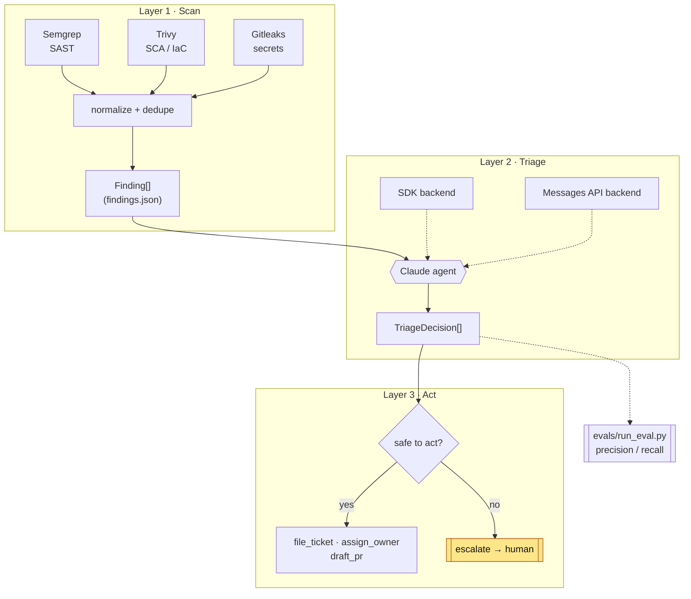

# AutoTriage — Architecture

AutoTriage is a three-stage pipeline that turns raw security-scanner output into an owned, prioritized, and partly self-remediating backlog. Everything is built around two typed contracts, which is what lets each stage be developed and tested independently.

## Overview



## The two contracts

Both live in `src/autotriage/schema.py` (Pydantic v2) and are the single source of truth for every stage.

### `Finding` — scanner output → agent input

A normalized security finding. Scanner adapters map each tool's native JSON onto this shape so downstream code never depends on a specific tool's format. Key fields: `id` (stable content hash via `Finding.make_id`), `tool` (`semgrep`/`trivy`/`gitleaks`), `type` (`SAST`/`SCA`/`IAC`/`SECRET`), `rule_id`, `title`, `severity_raw`, `cwe`/`owasp`, `file`/`line`/`code_snippet`, the SCA fields (`package`, `installed_version`, `fixed_version`), and `raw` (the untouched scanner record, preserved for audit).

### `TriageDecision` — agent output → action + eval input

The agent's structured verdict for one finding: `finding_id`, `verdict` (`true_positive`/`false_positive`/`needs_human`), normalized `severity`, `confidence` (0.0–1.0), `business_impact`, `reasoning`, `recommended_action` (`open_ticket`/`draft_pr`/`suppress`/`escalate`), `suggested_owner`, `remediation`, and `cwe`.

A `model_validator` bakes the core guardrail directly into the type: any decision with `confidence < GUARDRAIL_CONFIDENCE_THRESHOLD` (0.6) is coerced to `verdict = needs_human` / `recommended_action = escalate`. Low-confidence triage is *structurally* incapable of auto-acting.

## The three layers

### 1 · Scan — `autotriage.scanners`

Runs Semgrep, Trivy, and Gitleaks as subprocesses, parses each tool's JSON, normalizes every result into a `Finding`, dedupes by `id`, and writes `findings.json`. If a scanner is not installed it is skipped with a warning rather than failing the run.

```bash
python -m autotriage.scanners target/ -o findings.json
```

### 2 · Triage — `autotriage.agent`

Reads the findings and, for each one, asks Claude to produce a `TriageDecision` using **forced structured output** so the result always validates against the schema. The triage rubric (system prompt) covers severity/business-impact reasoning and the prompt-injection posture: scanner text is untrusted evidence, never instructions to follow.

### 3 · Act — the action tools

Every side effect is a validated tool call — no free-text actions:

- `file_ticket` — writes `tickets/<id>.md` and appends to `TRACKER.md`.
- `assign_owner` — resolves an owner from `CODEOWNERS`.
- `draft_pr` — writes a remediation diff/patch for review.
- `escalate` — routes the finding to a human queue.

The action gate applies the escalation policy (see [`escalation-policy.md`](escalation-policy.md)) before any autonomous action.

## The two backends

The agent can run against either of two interchangeable backends, selected with `--backend`:

- **`sdk`** — the **Claude Agent SDK**, which manages the agent loop and tool orchestration. This is the primary, JD-relevant path.
- **`api`** — the raw **Anthropic Messages API**, driving tool use and structured output directly. Useful where the SDK runtime isn't available and as a portability/robustness check.

Both consume the same `Finding[]` and emit the same `TriageDecision[]`, so the rest of the pipeline is backend-agnostic.

```bash
python -m autotriage --findings findings.json --backend sdk
python -m autotriage --findings findings.json --backend api --dry-run
```

## Data flow, end to end

1. **Scan** — `autotriage.scanners target/ -o findings.json` produces normalized `Finding[]`.
2. **Load** — the CLI (`python -m autotriage --findings findings.json`) validates the JSON into `Finding` objects.
3. **Triage** — the selected backend returns a validated `TriageDecision` per finding; the confidence guardrail runs at construction time.
4. **Act** — the action gate either invokes tools (`open_ticket`/`draft_pr`) or escalates; `--dry-run` prints the plan without writing anything.
5. **Evaluate** — `evals/run_eval.py` replays the agent over the labeled fixture and scores verdict precision/recall/accuracy plus severity agreement, feeding rubric and threshold tuning back into Layer 2.

## Evaluation loop

The eval harness closes the loop: it compares the agent's decisions against `evals/labeled_findings.json` (ground truth for the 15-finding fixture) and reports precision, recall, and accuracy. `--stub` runs the scoring path offline (no API key), which is what CI uses. The metrics are the feedback signal for tuning the triage rubric and the confidence threshold.
