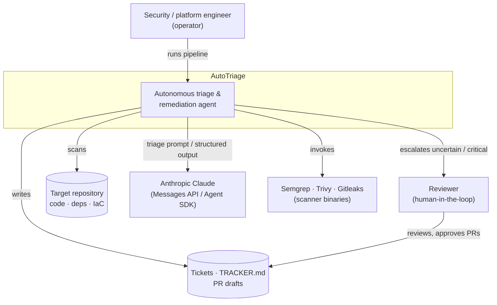
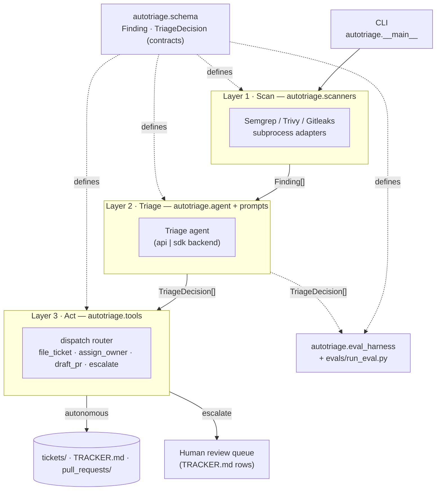
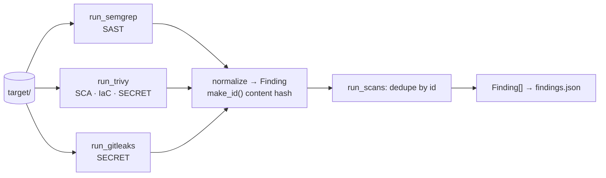
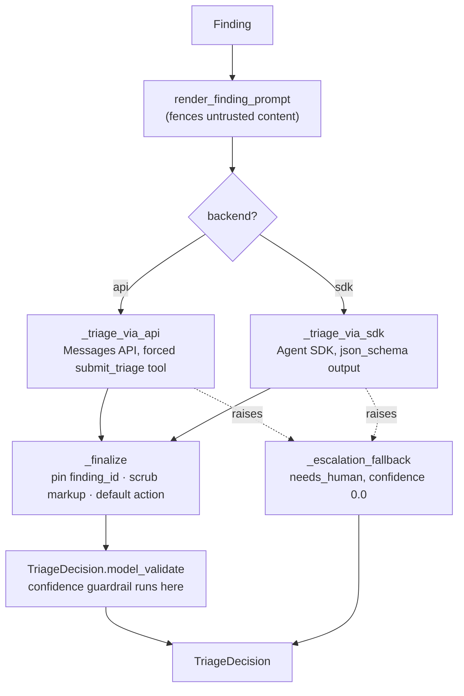
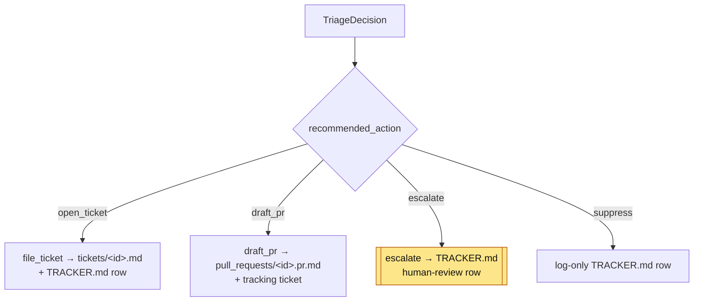
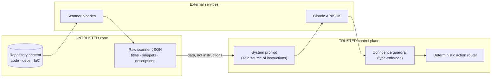

# AutoTriage — Architecture

AutoTriage is an autonomous vulnerability-triage and remediation agent. It turns
raw security-scanner output into an owned, prioritized, and partly
self-remediating backlog, while failing closed to a human wherever autonomous
action is not demonstrably safe.

This document describes the system in [C4-style](https://c4model.com/) views —
**system context**, **container**, and **component** — followed by the trust
boundaries, the two data contracts, the two backends, the end-to-end data flow,
the failure modes, and where the human sits in the loop. It reflects the code in
`src/autotriage/`; anything not yet built is marked **Roadmap**.

The load-bearing design decisions are recorded as [ADRs](adr/README.md).

## 1. System context (C4 Level 1)



AutoTriage sits between untrusted repository content and the humans who own the
security backlog. It calls out to scanner binaries and to Claude, and it never
merges code on its own — a reviewer approves any remediation PR.

## 2. Container view (C4 Level 2)

The system is a single Python package (`autotriage`) organized as three layers —
**scan → triage → act** — plus an evaluation harness. Each layer is a module that
communicates with the next only through the two typed contracts.



| Container | Module | Responsibility |
| --- | --- | --- |
| CLI | `autotriage.__main__` | Load findings, run triage, assign owners, dispatch (or `--dry-run`), print summary. |
| Scan | `autotriage.scanners` | Run scanner binaries, normalize + dedupe into `Finding[]`. |
| Triage | `autotriage.agent`, `autotriage.prompts` | Turn each `Finding` into a validated `TriageDecision` via Claude. |
| Act | `autotriage.tools` | Deterministic, offline actions: tickets, owners, PR drafts, escalation. |
| Contracts | `autotriage.schema` | The two Pydantic models every other layer depends on. |
| Eval | `autotriage.eval_harness`, `evals/run_eval.py` | Score decisions against labeled ground truth. |

## 3. Component view (C4 Level 3)

### 3.1 Scan layer — `autotriage.scanners`



Each adapter runs its tool as a subprocess with a fixed argument vector (never a
shell), parses stdout as JSON, and maps native records onto `Finding`. Adapters
are **defensive**: a missing binary, non-zero exit, or malformed JSON degrades to
an empty result with a warning, so one broken tool never aborts the scan
([ADR-0002](adr/0002-normalized-finding-contract.md)).

### 3.2 Triage layer — `autotriage.agent`



The system prompt (`autotriage.prompts.SYSTEM_PROMPT`) carries the analyst
persona, severity rubric, action mapping, honest-confidence instruction, and the
untrusted-input guardrail. Structured output is guaranteed by a forced tool call
or JSON-schema output ([ADR-0003](adr/0003-forced-tool-call-for-structured-output.md)).

### 3.3 Act layer — `autotriage.tools`



Every side effect is a pure, offline function — no LLM or network calls in this
layer. `dispatch` routes by `recommended_action`; a `draft_pr` also files a
tracking ticket. The same three write actions are optionally exposed as Claude
Agent SDK MCP tools via `build_action_mcp_server` for a fully autonomous mode.

## 4. Trust boundaries



- **Repository content and all `Finding` fields are untrusted data**, never
  instructions. The prompt fences them explicitly and the model is told to treat
  embedded directives as tampering signals
  ([ADR-0006](adr/0006-treat-scanner-output-as-untrusted.md)).
- **The system prompt is the only source of instructions** to the model.
- **The confidence guardrail is enforced in the type layer**, so no prompt or
  backend can produce a low-confidence auto-action
  ([ADR-0004](adr/0004-confidence-guardrail-and-fail-closed.md)).
- **`ANTHROPIC_API_KEY` crosses the boundary to Claude only**; scanner binaries
  run locally on repository content.

## 5. The two contracts

Both live in `src/autotriage/schema.py` (Pydantic v2) and are the single source
of truth for every layer. Full field reference: [data-contracts.md](data-contracts.md).

### `Finding` — scan output → triage input

A normalized security finding. Adapters map each tool's native JSON onto this
shape so downstream code never depends on a tool's format. Notable fields: `id`
(stable content hash via `Finding.make_id`), `tool`, `type`
(`SAST`/`SCA`/`IAC`/`SECRET`), `rule_id`, `severity_raw`, `cwe`/`owasp`,
`file`/`line`/`code_snippet`, the SCA fields (`package`, `installed_version`,
`fixed_version`), and `raw` (the untouched record, kept for audit).

### `TriageDecision` — triage output → act + eval input

The agent's structured verdict: `finding_id`, `verdict`
(`true_positive`/`false_positive`/`needs_human`), normalized `severity`,
`confidence` (0.0–1.0), `business_impact`, `reasoning`, `recommended_action`
(`open_ticket`/`draft_pr`/`suppress`/`escalate`), `suggested_owner`,
`remediation`, `cwe`.

A `model_validator` bakes the guardrail into the type: any decision with
`confidence < GUARDRAIL_CONFIDENCE_THRESHOLD` (0.6) is coerced to
`verdict = needs_human` / `recommended_action = escalate`.

## 6. The two backends

Selected with `--backend`; both consume `Finding` and emit `TriageDecision`, so
the pipeline is backend-agnostic ([ADR-0005](adr/0005-dual-backend-sdk-and-messages-api.md)).

- **`api`** (default, most reliable) — Anthropic Messages API with a single forced
  `submit_triage` tool whose `input_schema` is the `TriageDecision` JSON schema.
- **`sdk`** — Claude Agent SDK `query` with `output_format` of type `json_schema`,
  read from the result's `structured_output`; also the path for the optional
  autonomous MCP-tool mode.

Both read `ANTHROPIC_API_KEY`, import their third-party dependency lazily, and
default the model to `AUTOTRIAGE_MODEL` or `claude-sonnet-5`.

```bash
python -m autotriage.scanners target/ -o findings.json
python -m autotriage --findings findings.json --backend api
python -m autotriage --findings findings.json --backend sdk --dry-run
```

## 7. Data flow, end to end

1. **Scan** — `autotriage.scanners target/ -o findings.json` produces normalized,
   de-duplicated `Finding[]`.
2. **Load** — the CLI validates the JSON into `Finding` objects.
3. **Triage** — the selected backend returns a validated `TriageDecision` per
   finding; the confidence guardrail runs at construction.
4. **Own** — if the model gave no `suggested_owner`, `assign_owner` resolves one
   from `CODEOWNERS`.
5. **Act** — `dispatch` files tickets / drafts PRs / escalates; `--dry-run` prints
   the plan and writes nothing.
6. **Evaluate** — `evals/run_eval.py` replays the agent over the labeled fixture
   and scores verdict precision/recall/F1, accuracy, and severity agreement,
   feeding rubric and threshold tuning back into Layer 2
   ([eval-methodology.md](eval-methodology.md)).

## 8. Failure modes — fail closed to human

Every failure path converges on the same safe outcome: a human decides.

| Failure | Where handled | Behavior |
| --- | --- | --- |
| Scanner binary missing / crashes / bad JSON | `autotriage.scanners` | Log warning, skip that tool, continue with others. |
| Model does not call the tool / no structured output | `agent._triage_via_*` | Raise, caught below. |
| API error, timeout, malformed payload | `agent.triage_all` | Per-finding `_escalation_fallback`: `needs_human`, `confidence 0.0`, `escalate`. Batch continues. |
| Low confidence (`< 0.6`) | `TriageDecision` validator | Coerced to `needs_human` / `escalate`. |
| Missing `recommended_action` | `agent._finalize` | Safe default derived from verdict (unknown verdict → `escalate`). |
| Leaked prompt/tool markup in free-text | `agent._strip_leaked_markup` | Field truncated at the first marker before it reaches a ticket/PR. |
| Suspected prompt injection | Prompt + escalation policy | Not obeyed; escalated to a human with the raw snippet. |

See the [escalation policy](escalation-policy.md) for the precise
autonomous-vs-escalate decision table.

## 9. Where the human sits in the loop

- **Escalations** — any `needs_human` / `escalate` decision is recorded as a
  `TRACKER.md` row for a human to triage from scratch.
- **Critical findings** — auto-open a ticket and assign an owner so nothing
  critical sits silently in a backlog, **but a remediation PR is never
  auto-merged**: the agent may draft the fix; a human reviews and approves before
  it lands.
- **Suppressions** — false positives are suppressed with the model's reasoning and
  confidence recorded, so any autonomous decision is auditable and reversible.

## 10. Roadmap (not yet implemented)

- Parallel/batched triage across findings (currently sequential in `triage_all`).
- CI eval gate that fails the build on a metrics regression (see
  [eval-methodology.md](eval-methodology.md)).
- Real ticketing/VCS integrations (Jira, GitHub PRs) behind the current
  file-based `tickets/`, `TRACKER.md`, and `pull_requests/` artifacts.
- Wiring `bandit` / `pip-audit` self-scans into the CI workflow (currently
  configured as dev dependencies; see [security-posture.md](security-posture.md)).
