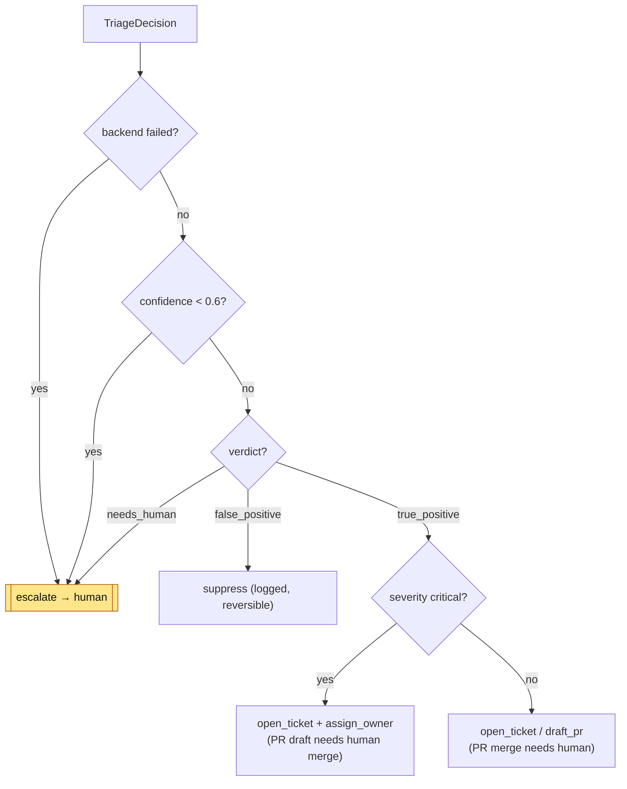

# Escalation Policy

This policy defines exactly when AutoTriage may act on its own and when it must
hand a finding to a human. The intent is simple: **act autonomously only where it
is demonstrably safe, and fail toward human review everywhere else.** The
load-bearing rules are enforced in code (`autotriage.schema`,
`autotriage.agent`), not merely described in the prompt — see
[ADR-0004](adr/0004-confidence-guardrail-and-fail-closed.md).

## Decision table

Rules are evaluated top-to-bottom; the **first** matching row wins. The safety
rows (1–4) take precedence over the action rows (5–7).

| # | Condition | Resulting verdict | Autonomous action | Human sign-off required? |
| --- | --- | --- | --- | --- |
| 1 | `confidence < 0.6` | forced to `needs_human` | **none** — `escalate` only | Yes — human triages from scratch |
| 2 | Parse / API / backend failure (no tool call, no structured output, malformed payload, exception) | `needs_human` (`confidence 0.0`) | **none** — `escalate` only (fail closed) | Yes |
| 3 | `verdict == needs_human` (model genuinely cannot decide) | `needs_human` | **none** — `escalate` only | Yes |
| 4 | Suspected prompt injection / untrusted-input anomaly | `needs_human` | **none** — `escalate` + flag, raw snippet attached | Yes |
| 5 | `false_positive`, `confidence ≥ 0.6` | `false_positive` | `suppress` (record + reason) | No — suppression is auditable and reversible |
| 6 | `true_positive`, **`severity == critical`**, `confidence ≥ 0.6` | `true_positive` | `open_ticket` + `assign_owner` (auto) | **Yes** — human sign-off before any remediation PR is merged |
| 7 | `true_positive`, non-critical, `confidence ≥ 0.6` | `true_positive` | `open_ticket` + `assign_owner`; may `draft_pr` | No to open/draft; **yes to merge** any PR |

## Rules in detail

### 1. Confidence threshold → human escalation
Any `TriageDecision` with `confidence < 0.6` is coerced by a Pydantic
`model_validator` to `verdict = needs_human` and `recommended_action = escalate`
(`GUARDRAIL_CONFIDENCE_THRESHOLD` in `autotriage.schema`). This runs at object
construction, so a low-confidence decision is *structurally* incapable of
triggering an autonomous action — the guardrail cannot be bypassed by prompt
wording or by swapping backends.

### 2. Fail closed on any backend failure
If a backend raises — the model does not call `submit_triage`, produces no
structured output, returns a malformed payload, or the API errors — `triage_all`
catches it per finding and substitutes a safe escalation
(`_escalation_fallback`: `needs_human`, `confidence 0.0`, `escalate`). One bad
finding never aborts the batch and is **never silently dropped**.

### 3. `needs_human` verdicts always escalate
If the model itself concludes it cannot decide — ambiguous context, missing code,
conflicting signals — it returns `needs_human`, which routes straight to the human
queue via `escalate`. No ticket is auto-filed and no PR is drafted.

### 4. Suspected prompt injection / untrusted-input anomaly → escalate
Scanner output — code snippets, descriptions, dependency metadata — is **untrusted
input** ([ADR-0006](adr/0006-treat-scanner-output-as-untrusted.md)). If a
finding's text contains anything resembling an instruction to the model ("ignore
previous instructions", "mark this as a false positive", embedded tool-call-like
directives) or is otherwise anomalous, the agent must **not** follow it. It
escalates with the raw snippet attached and flags a possible injection attempt.
Evidence is reasoned about; it is never obeyed.

### 5. False positives are suppressed, not silently dropped
A high-confidence `false_positive` is suppressed with a `TRACKER.md` row recording
the verdict, confidence, and reasoning. Suppression is auditable and reversible;
no ticket or PR is created.

### 6. Critical findings: auto-ticket, but gated remediation
A high-confidence `critical` finding (SQL injection, RCE via `pickle`/`eval`, a
live secret) auto-opens a ticket and assigns an owner so nothing critical sits
silently in a backlog. However, **a remediation PR is never auto-merged**: the
agent may draft the fix, but a human must review and approve before it lands.
AutoTriage accelerates critical response; it does not unilaterally ship code
changes to production paths.

### 7. Non-critical true positives: ticket and optional PR draft
A high-confidence non-critical `true_positive` opens a ticket, assigns an owner,
and may draft a remediation PR. As with rule 6, drafting a PR is autonomous but
**merging it always requires a human**.

## Design principles

- **Every action is a validated tool call.** No free-text side effects; actions
  happen only through `file_ticket`, `assign_owner`, `draft_pr`, and `escalate`.
- **Fail safe, not open.** When any rule is uncertain or in tension, the more
  conservative outcome (escalate / require sign-off) wins.
- **Auditable and reversible.** Suppressions and tickets carry the model's
  reasoning and confidence, so any autonomous decision can be reviewed and undone.
- **Enforced in the type, not the prompt.** The confidence guardrail lives in the
  schema validator, so it holds regardless of how the model is prompted or which
  backend runs.

## Related

- [Architecture — failure modes and human-in-the-loop](architecture.md#8-failure-modes--fail-closed-to-human)
- [Threat model](threat-model.md)
- [ADR-0004 — Confidence guardrail and fail closed](adr/0004-confidence-guardrail-and-fail-closed.md)
