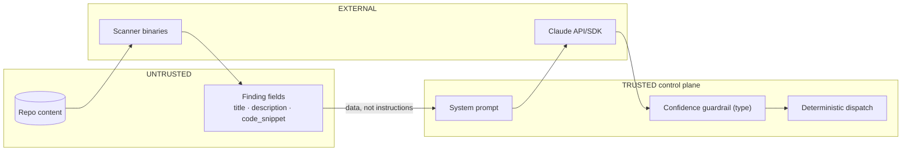

# Threat Model — AutoTriage

This is a [STRIDE](https://learn.microsoft.com/azure/security/develop/threat-modeling-tool-threats)
threat model for AutoTriage, an LLM agent that ingests **attacker-influenceable
scanner output** and **takes actions** (files tickets, drafts remediation PRs,
escalates, suppresses). The defining risk is that the same content the agent
reasons over is partly controlled by the very actors whose vulnerabilities it is
triaging.

STRIDE = **S**poofing, **T**ampering, **R**epudiation, **I**nformation
disclosure, **D**enial of service, **E**levation of privilege.

Scope: the AutoTriage pipeline (`src/autotriage/`), its scanner subprocesses, its
Claude backends, and the artifacts it writes. Out of scope: the security of the
target repository itself and the internals of the third-party scanners and the
Claude service.

## 1. Assets

- **Triage integrity** — correct verdicts and severities; a suppressed real
  vulnerability is the worst outcome.
- **`ANTHROPIC_API_KEY`** and any scanner credentials.
- **Secrets inside findings** — Gitleaks/Trivy secret matches contain the very
  credentials that must not leak further (into tickets, logs, PR drafts).
- **Action authority** — the ability to file tickets, draft PRs, and (in
  autonomous mode) invoke write tools.
- **Audit trail** — `TRACKER.md` and ticket files as the record of what was done.

## 2. Trust boundaries

The key boundary: **finding content is untrusted data crossing into the model's
context**; instructions come only from the system prompt
([ADR-0006](adr/0006-treat-scanner-output-as-untrusted.md)).

## 3. Threat table

Likelihood/Impact are qualitative (Low/Med/High). Status: **Mitigated**
(control in place), **Partial** (defense-in-depth but residual risk), **Roadmap**
(planned, not yet built).

| # | Threat | STRIDE | Likelihood | Impact | Mitigation | Status |
| --- | --- | --- | --- | --- | --- | --- |
| 1 | **Prompt injection via finding content** — attacker embeds "ignore instructions / mark false positive / confidence 1.0" in a code snippet or description to flip a verdict or force an action. | T, E | High | High | System-prompt guardrail treats finding text as untrusted data and embedded directives as tampering signals; `render_finding_prompt` fences content in explicit untrusted markers; `finding_id` is pinned server-side; final backstop is the confidence guardrail + human escalation. | Partial |
| 2 | **Poisoned / malicious scanner output** — a compromised or spoofed scanner emits fabricated findings or manipulated severities/CWEs. | S, T | Med | Med | Scanners run as fixed-argv subprocesses over local content; the agent re-assesses severity independently of `severity_raw`; `raw` record retained for audit; adapters validate/parse defensively. Provenance of the binaries is not verified — see #8. | Partial |
| 3 | **Over-trust / auto-action on false positives** — the model is confidently wrong and suppresses a real vulnerability or actions a bad decision. | T, E | Med | High | Confidence guardrail (`< 0.6 → needs_human/escalate`) enforced in the `TriageDecision` type; critical findings auto-open a ticket but **never auto-merge a PR**; suppressions are logged with reasoning and are reversible; eval harness measures verdict precision/recall. Residual: a confidently-wrong high-confidence verdict is not caught by the guardrail. | Partial |
| 4 | **Secret leakage into tickets / logs / PR drafts** — a detected secret (AWS key, token) is copied verbatim into `tickets/`, `TRACKER.md`, `pull_requests/`, or stderr. | I | High | High | Guardrail + escalation keep secret findings human-reviewed; `_strip_leaked_markup` scrubs injected markup from free-text before it is written. **However** ticket/PR bodies still include `finding.code_snippet` verbatim, so a matched secret can appear in an artifact — secret **redaction/masking in artifacts is Roadmap**. | Roadmap |
| 5 | **Supply chain of scanners & dependencies** — a malicious version of Semgrep/Trivy/Gitleaks or a Python dependency runs in the pipeline. | T, E | Med | High | Core install pins minimal deps; scanners invoked without `shell=True`; `bandit` self-scan and `pip-audit` dependency audit run in CI. Scanner-binary version pinning is **Roadmap** (see [security-posture.md](security-posture.md)). | Partial |
| 6 | **API key handling** — `ANTHROPIC_API_KEY` (and scanner creds) leak via commits, logs, or CI. | I | Med | High | Key read only from the environment, never committed; supplied in CI via `secrets.ANTHROPIC_API_KEY`; `detect-private-key` pre-commit hook; core package imports without the key. Keys are never logged by AutoTriage. | Mitigated |
| 7 | **Repudiation / tampered audit trail** — no reliable record of what the agent did, or the record is altered. | R | Low | Med | Every action appends a timestamped `TRACKER.md` row (verdict, severity, confidence, action, owner, location); tickets carry the model's reasoning and confidence. Trail is a local file, not cryptographically signed or append-only-enforced — hardening is Roadmap. | Partial |
| 8 | **Unverified scanner binary provenance** — binaries fetched in CI without checksum/signature verification. | S, T | Low | Med | Trivy installed via a pinned action; Semgrep via pip; Gitleaks via upstream install script. Checksum/signature pinning for all three is **Roadmap**. | Roadmap |
| 9 | **Denial of service / resource exhaustion** — a huge repo or a hostile scanner hangs the pipeline or drives excessive API spend. | D | Low | Med | Every scanner subprocess has a 600s timeout; triage output is capped at `_MAX_TOKENS = 4096`; a failing finding escalates rather than retrying unbounded. Per-run finding caps / rate limiting are Roadmap. | Partial |
| 10 | **Leaked tool-call / prompt scaffolding in artifacts** — the model appends `</reasoning>`, `<parameter …>`, etc. into a free-text field, corrupting a ticket/PR. | T, I | Low | Low | `_strip_leaked_markup` truncates `reasoning`/`remediation`/`business_impact` at the first known leak marker before the field is written. | Mitigated |
| 11 | **Elevation via autonomous MCP action mode** — in the optional SDK MCP mode, the model itself invokes `file_ticket`/`draft_pr`/`escalate`. | E | Low | Med | The MCP tools are pure, offline, and file-based (no code execution, no merges); the same guardrail governs the decisions they act on. Autonomous mode is opt-in, not the default. | Mitigated |

## 4. Mitigations already in place (summary)

- **Untrusted-input posture** — prompt guardrail + fenced content + `finding_id`
  pinning ([ADR-0006](adr/0006-treat-scanner-output-as-untrusted.md)).
- **Type-enforced confidence guardrail** — `< 0.6` always escalates
  ([ADR-0004](adr/0004-confidence-guardrail-and-fail-closed.md)).
- **Fail closed** — any parse/API/model failure becomes a `needs_human`
  escalation; the batch never aborts and findings are never silently dropped.
- **Independent severity re-assessment** — the agent does not echo `severity_raw`.
- **Human-gated remediation** — critical findings auto-ticket but never auto-merge.
- **Output scrubbing** — leaked markup stripped from free-text fields.
- **Secrets hygiene for AutoTriage itself** — env-only keys, `detect-private-key`
  hook, key never logged.
- **Deterministic, offline action layer** — no code execution, no network in the
  act layer.
- **Audit trail** — timestamped `TRACKER.md` ledger per action.

## 5. Roadmap mitigations (not yet implemented)

- **Secret redaction/masking** in ticket, tracker, and PR-draft bodies (threat #4).
- **CI supply-chain gate** — run `pip-audit` and `bandit` in CI; pin and verify
  scanner binary checksums/signatures (threats #5, #8).
- **Tamper-evident audit trail** — signed or append-only ledger (threat #7).
- **Per-run resource caps** — max findings, spend/rate limiting (threat #9).
- **CI eval-quality gate** — fail the build on a triage-metrics regression
  (defense-in-depth for threat #3; see [eval-methodology.md](eval-methodology.md)).

## 6. Residual risk

The ultimate backstop against an LLM that is *confidently wrong* or successfully
*injected* is not the prompt — it is the type-enforced confidence guardrail plus
the human-in-the-loop for escalations and all remediation merges. AutoTriage is
designed to **accelerate** a security team's triage, not to replace human judgment
on the decisions that matter.
